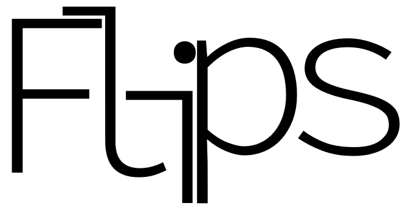

## What is Flips?
Flips is a simple music player designed for everyday users. The main goal of Flips is to be fast and user-friendly. It is made with HTML, JavaScript and CSS on the Electron framework.

## How do I start it?
At the moment Flips is an ongoing project with a very early build available. Currently the only way to play songs is to follow these steps:

* Make sure you have Node.js installed. If not then go to [here](https://nodejs.org).
  * LINUX USERS: Make sure to install the `npm` package if you installed Node.js through your package manager.
* Unzip the file if you downloaded the ZIP version. If you cloned the repository via the command line then go to step four.
* Open Command Prompt/Powershell on Windows, or Terminal on macOS/Linux.
* Navigate to the download location of Flips and go inside the folder.
* Run `npm install` and wait for the packages to install/update.
* If no errors appeared (there may be a few warnings, I'm working on it!) then run `npm start` and start listening!
  * At the moment Flips can only play a song in the same directory as main.js with the filename `song.mp3` and `song.ogg`, so if you want to help create a system that plays songs with other filenames, feel free to make a pull request. For now, rename the song you want to either `song.mp3` or `song.ogg`.

Thanks for downloading and supporting open-source projects!

Want to reach me? Here are your options:
* [Personal Twitter](https://twitter.com/malachyallen)
* [Development Twitter](https://twitter.com/SamFujisaki)
* Email: samfujisakidev@gmail.com
* [Discord Server](https://discord.gg/5gAAFae)
* Discord Username: Samaritan#1241
* Matrix: @samfujisaki:matrix.org
